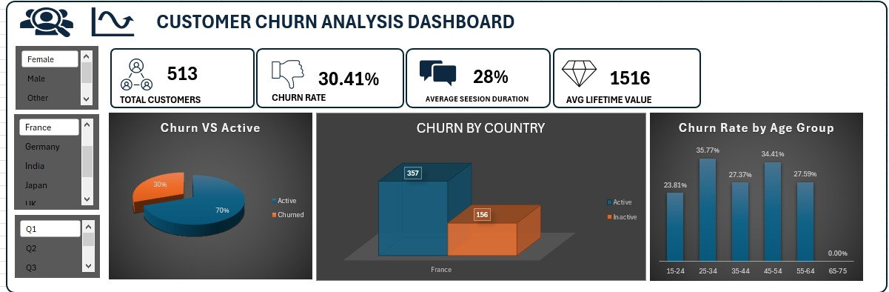
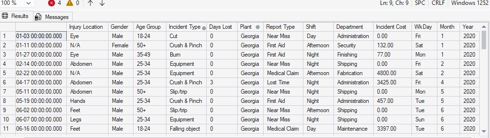
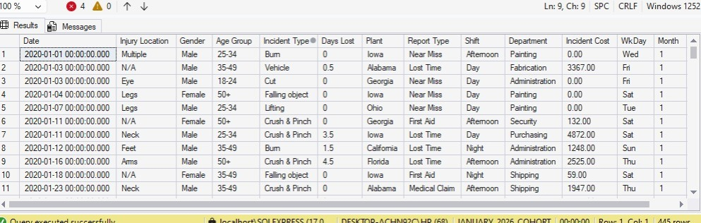
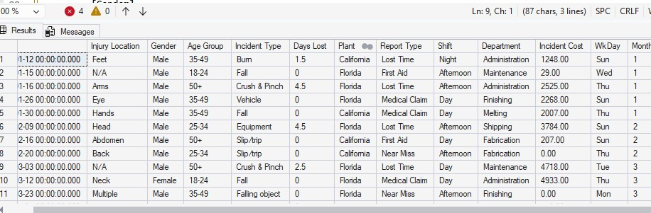
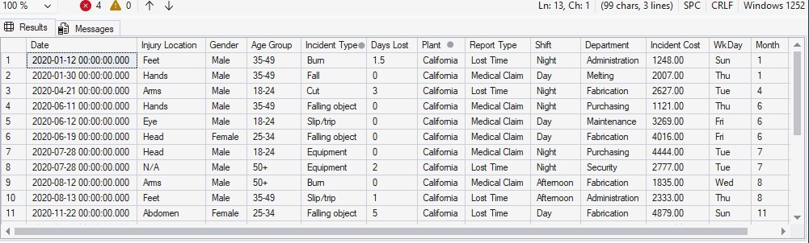
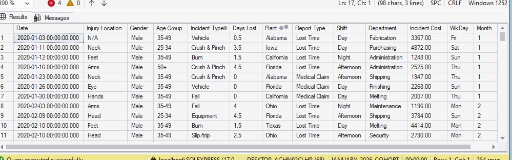
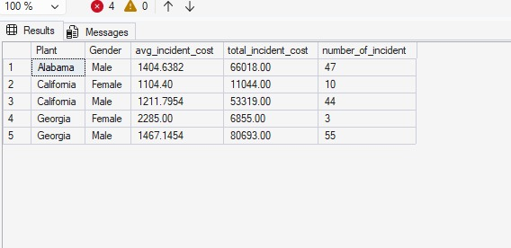
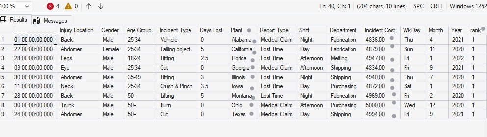

# Data Analysis Portfolio

**PROJECT 1**
# 📊 [Customer Churn Analysis Dashboard](https://github.com/justvictorav/justvictorav.github.io/blob/main/ecommerce%20customer%20churn%20dashboard.xlsx)

## 🔍 Project Overview
Customer churn is a major challenge for businesses, as losing customers directly impacts revenue and growth.  
This project analyses customer data to identify churn patterns, understand customer behaviour, and highlight key risk factors.

---

## 🛠️ Tools Used
- Microsoft Excel  
- Pivot Tables  
- Slicers  
- Data Cleaning & Transformation  

---

## 📈 Key Metrics
- Total Customers: 50,000  
- Churn Rate: 28.9%  
- Average Session Duration: 28 Mins 
- Average Lifetime Value: $1441  

---

## 💡 Key Insights
- The churn rate is relatively high (~29%), indicating a potential retention issue.  
- Churn is consistent across countries, suggesting the problem is systemic rather than location-specific.  
- Younger customers show slightly higher churn rates compared to older groups.  
- With an average lifetime value of $1441 per customer, churn represents a significant revenue loss.  

---

## 📊 Dashboard Features
- Interactive filters (Gender, Country, Signup Quarter)  
- KPI overview for quick performance tracking  
- Visual breakdown of churn distribution  
- Regional and demographic churn analysis  

---

## 📁 Dataset
The dataset used represents e-commerce customer behaviour, including demographics, engagement, and churn indicators.

---

## 🖼️ Dashboard Preview


---

## 🚀 Conclusion
This dashboard provides a clear overview of customer churn patterns and highlights areas where businesses can focus their retention strategies to improve long-term profitability.


**PROJECT 2**
# 📊 [Sales & Profit Performance Dashboard (Superstore Analysis)](https://github.com/justvictorav/justvictorav.github.io/blob/main/Sample%20-%20Superstore.xlsx)

## 🔍 Project Overview
This project analyses retail sales data to evaluate business performance across regions, product categories, customers, and shipping methods.  

The goal is to identify:
- Revenue drivers  
- Profitability gaps  
- High-value customers  
- Operational inefficiencies  

The dashboard provides an interactive way to explore trends and uncover insights that support data-driven decision-making.

---

## 🛠️ Tools Used
- Microsoft Excel  
- Pivot Tables & Pivot Charts  
- Slicers (Year, Month, Category)  
- Data Cleaning & Aggregation  
- KPI Design & Dashboard Layout  

---

## 📈 Key Metrics
- Total Sales: $2,297,201  
- Total Profit: $286,397  
- Profit Margin: 12.47%  

---

## 💡 Key Insights

### 1. Profitability is Uneven Across Categories
- Technology generates the highest profit contribution  
- Furniture shows weaker profitability despite strong sales  

👉 This suggests cost inefficiencies or heavy discounting in Furniture.

---

### 2. Sales Are Concentrated in Key States
- A small number of states (e.g., California, New York) dominate total sales  
- Several states contribute significantly less  

👉 The business is geographically dependent on a few strong markets, increasing risk.

---

### 3. High Sales ≠ High Profit
- Some high-sales areas or products do not translate into high profit  

👉 Indicates:
- Excessive discounting  
- High operational/logistics costs  

---

### 4. Customer Revenue is Highly Skewed
- A small group of customers contributes a large portion of profit  

👉 Opportunity:
- Focus on customer retention strategies for top clients  

---

### 5. Shipping Mode Impacts Order Volume
- Standard Class dominates order quantity  
- Faster shipping modes are used significantly less  

👉 Suggests:
- Customers are price-sensitive rather than speed-sensitive  
- Opportunity to optimise logistics costs  

---

## 📊 Dashboard Features
- KPI summary (Sales, Profit, Margin)  
- Time-based analysis (Profit by Year)  
- Geographic performance (Sales by State & City)  
- Customer-level insights (Top 5 Customers)  
- Category performance breakdown  
- Operational view (Shipping Mode distribution)  

### Interactive Filters:
- Year  
- Month  
- Category  

---

## 📁 Dataset
The dataset used is the Superstore Sales dataset, containing:
- Order details  
- Customer information  
- Product categories  
- Sales, profit, and discount data  
- Shipping and regional data  

---

## 🖼️ Dashboard Preview


---

## 🚀 Business Recommendations

### 1. Improve Furniture Profitability
- Review pricing and discount strategy  
- Reduce cost of goods or logistics where possible  

---

### 2. Reduce Over-Reliance on Key Regions
- Expand marketing in underperforming states  
- Identify barriers to sales in low-performing regions  

---

### 3. Optimise Discount Strategy
- Investigate products with high sales but low profit  
- Implement controlled discounting  

---

### 4. Focus on High-Value Customers
- Introduce loyalty or retention programs  
- Personalised offers for top contributors  

---

### 5. Leverage Cost-Efficient Shipping
- Promote Standard Class where appropriate  
- Analyse cost vs speed trade-offs  

---

## 🧠 Skills Demonstrated
- Data Analysis & Interpretation  
- Business Insight Generation  
- Dashboard Design (Excel)  
- KPI Development  
- Stakeholder-Oriented Thinking  

---

**PROJECT 3**
# SQL-PROJECTS
# Workplace Safety Incident Analysis using SQL

## Business Context
A manufacturing company is experiencing increasing workplace incident costs across multiple plant locations.  

The operations team has requested a data analysis to:
- Identify high-risk locations  
- Understand cost drivers  
- Highlight severe incidents  
- Support safety improvement decisions  

---

## Dataset  
Workplace Safety Data  

Key fields include:

- Date  
- Injury Location  
- Gender  
- Age Group  
- Incident Type  
- Days Lost  
- Plant  
- Report Type  
- Shift  
- Department  
- Incident Cost  
- WkDay  
- Month  
- Year

---

## SQL Questions and SQL Solutions

### 1. Identify all incidents that occurred in the Georgia plant
```sql
SELECT *
FROM [dbo].['Workplace Safety Data$']
WHERE PLANT='GEORGIA'
```
## 🖼️Preview

---

### 2. Retrieve incidents that are not classified as FALL-related
```sql
SELECT *
FROM [dbo].['Workplace Safety Data$']
WHERE [INCIDENT TYPE] <> 'fall'
```
## 🖼️Preview



---

### 3. Analyze incidents in key operational locations (California and Florida)
```sql
SELECT *
FROM[dbo].['Workplace Safety Data$']
WHERE PLANT IN ('CALIFORNIA','FLORIDA')
```
## 🖼️Preview


---

### 4. Identify high-cost incidents in California (cost greater than 1000)
```sql
SELECT *
FROM[dbo].['Workplace Safety Data$']
WHERE PLANT = 'CALIFORNIA' AND [INCIDENT COST]>1000
```
## 🖼️Preview


---

### 5. Identify incidents based on either location(CALIFORNIA) or cost condition(>1000)
```sql
SELECT *
FROM[dbo].['Workplace Safety Data$']
WHERE PLANT = 'CALIFORNIA' OR [INCIDENT COST]>1000
```
## 🖼️Preview

---

### 6. Calculate average, total, and count of incident costs by plant and gender in the following plants (ALABAMA CALIFORNIA GEORGIA)
```sql
select [Plant]
  ,[Gender]
  ,avg([Incident Cost]) as avg_incident_cost
  ,sum([Incident Cost]) as total_incident_cost
  ,count(*) as number_of_incident
  from[dbo].['Workplace Safety Data$']
  group by [Plant]
          ,[Gender]
  having plant in ('alabama','california','georgia')
 order by[Plant] asc
```
## 🖼️Preview

---

### 7. Identify the highest-cost incident in each plant
```sql
with incident_rank as
(
select * 
       ,rank () over( partition by[Plant] order by [Incident Cost] desc) as rank
from[dbo].['Workplace Safety Data$']
)

select*
from incident_rank
where rank=1 
```
## 🖼️Preview

---

## Key Insights
- Some plants generate significantly higher incident costs than others  
- High-cost incidents are concentrated in specific locations  
- Gender-based patterns exist in incident distribution  
- Categorizing incidents helps prioritize safety improvements  

---

## Tools Used
- SQL Server  
- Excel (data preparation)

---

## Conclusion

This project demonstrates the use of SQL to analyze workplace safety data and extract meaningful business insights. By applying filtering, aggregation, window functions, and conditional 


